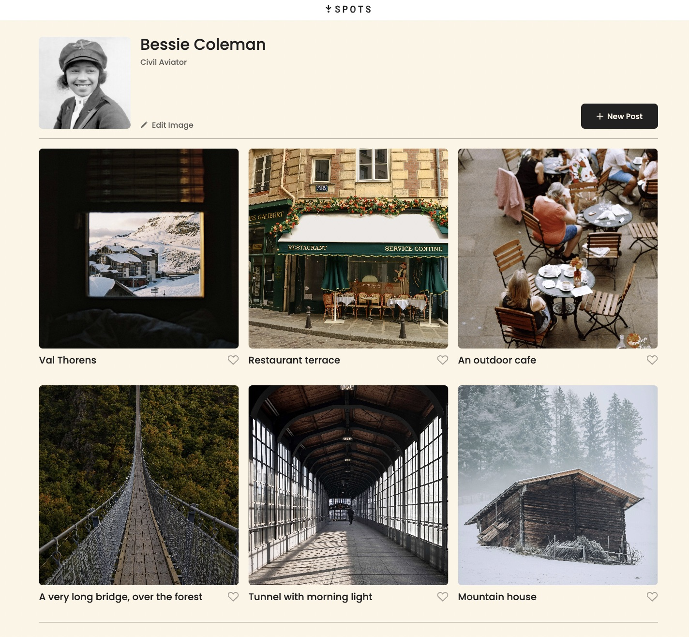

# Project 3: Spots
  
**Overview**
  
For this project, I created an interactive social media web application where users can add and remove photos, like others' photos, and make minor adjustments to their profiles. To ensure full responsiveness, I used HTML and CSS, leveraging the BEM methodology for better structure. The project is organized with separate directories for BEM blocks, images, and vendor files like normalize.css. Media queries are applied to guarantee the layout adapts smoothly across various screen sizes, while keeping content centered with consistent typography, colors, and spacing based on the design. To handle text overflow, I employed CSS techniques like text-overflow: ellipsis and white-space: nowrap, preventing long text from breaking the layout. Additionally, Flexbox was used to create a flexible design that aligns content efficiently across devices. Best practices for HTML5 semantics and accessibility are followed, including proper heading hierarchy and alt text for images. This is the first time I integrated font files and @font-face declarations into my project’s vendor directory to ensure proper font rendering and organization. It’s also my first time using Figma, where I translated a design into code for the project.

**Technologies Used**
* HTML5
* CSS3
* BEM Methodology
* Flexbox
* Figma

  
**Figma**  
  
* [Link to the project on Figma](https://www.figma.com/file/BBNm2bC3lj8QQMHlnqRsga/Sprint-3-Project-%E2%80%94-Spots?type=design&node-id=2%3A60&mode=design&t=afgNFybdorZO6cQo-1)
  
# Images

**Desktop, 1440px**

  

 
**Mobile/Responsive, 627px**

  

**Elipsis, Mobile/Responsive**

  

  
# The Live Page
**You can check out the page here:(https://junger7.github.io/se_project_spots/)**

# Video 
[Video about project available here](https://drive.google.com/file/d/1POX8wdYk52OjKxMRgvzF7_d7CCU1IF9L/view?usp=sharing)
